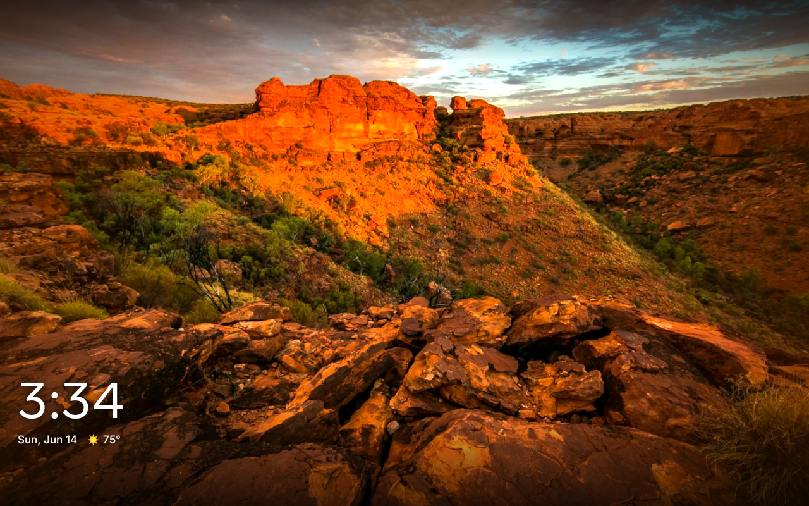
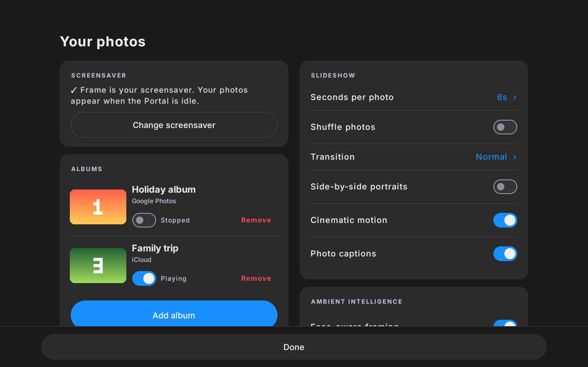
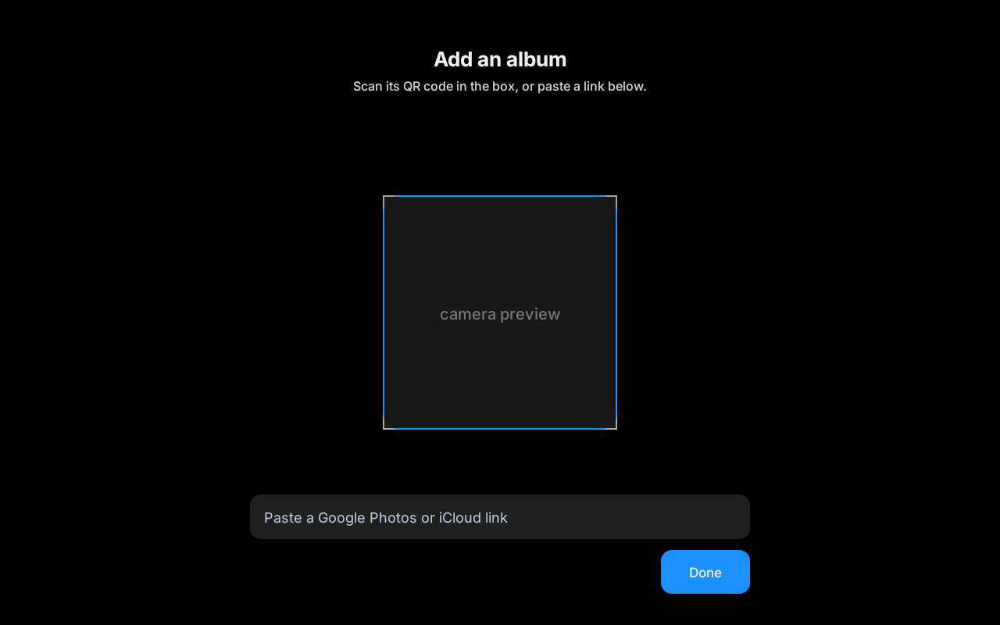
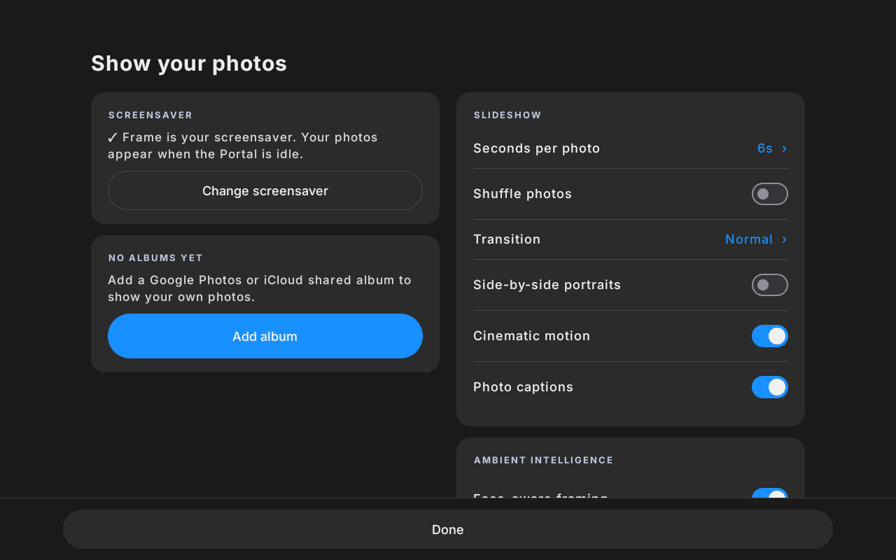

<div align="center">

# 🖼️ Frame

### An open-source photo screensaver for the Meta Portal Go

Show your **Google Photos** or **iCloud** shared albums — or photos you **push straight from your phone**
over Wi‑Fi — whenever your Portal is idle. Set it up on-device by scanning a QR code, then enjoy a clock,
captions, cinematic motion, and ambient color.

<br>

[](https://github.com/Ishtiaqhossain/Portal-Frame/actions/workflows/ci.yml)
[](https://github.com/Ishtiaqhossain/Portal-Frame/releases/latest)
[](https://github.com/Ishtiaqhossain/Portal-Frame/releases)
[](LICENSE)

[](https://kotlinlang.org)
[](https://developer.android.com/jetpack/compose)
[](https://developer.android.com)
[](https://www.meta.com/portal/)

**[⬇️ Download APK](https://github.com/Ishtiaqhossain/Portal-Frame/releases/latest/download/Frame.apk)** ·
**[📖 Install Guide](INSTALL.md)** ·
**[✨ Features](#-features)** ·
**[🛠️ Developers](#-for-developers)** ·
**[🤝 Contributing](CONTRIBUTING.md)**

</div>

> **Repo:** `PortalFrame` (`com.portalhacks.frame`) · **App name:** Frame · **Target:** Meta Portal Go (Android 10 / API 29)

---

## 📥 Install it on a Portal

### ⬇️ [Download the latest APK](https://github.com/Ishtiaqhossain/Portal-Frame/releases/latest/download/Frame.apk)

That link always serves the newest signed release. Prefer to pick a version (or grab the
`.sha256` checksum)? Browse all builds on the **[Releases page](https://github.com/Ishtiaqhossain/Portal-Frame/releases/latest)**.

Then follow the **[Install & User Guide](INSTALL.md)** — install the APK, add your album, and turn it
on as the screensaver.

## 📸 Screenshots

<table>
  <tr>
    <td width="50%"><br><sub><b>Slideshow</b> — your photos when the Portal is idle</sub></td>
    <td width="50%"><br><sub><b>Albums</b> — add several, stop or remove each</sub></td>
  </tr>
  <tr>
    <td><br><sub><b>Add an album</b> — scan a QR or paste a link</sub></td>
    <td><br><sub><b>Setup</b> — first run</sub></td>
  </tr>
</table>

<sub>Sample photos shown; personal photos, album names and links are scrubbed.</sub>

## ✨ Features

- 🖼️ **Shared albums** — plays a **Google Photos or iCloud** shared album; new photos appear automatically.
- 📱 **Add photos from a phone** — scan Frame's on-screen QR with any phone on the same Wi‑Fi, pick
  photos from your camera roll in the browser, and they appear on the frame instantly and stay in the
  rotation. No app, no account, no cloud — the photos go straight from your phone to the Portal.
- 📷 **On-device setup** — **QR scan** or paste the link; no computer needed after install.
- 🕰️ **Live overlays** — clock & weather, photo date captions, shuffle, adjustable timing and transitions.
- 🎬 **Cinematic touches** — side-by-side portraits, pan/zoom (Ken Burns), auto-enhance, ambient color,
  night dimming, and "On This Day" memories — all toggleable.
- 👆 **Touch controls** — **swipe** to change photo, **tap** to dismiss, **long-press** to open setup.

## 🛠️ For developers

100% Kotlin — Jetpack Compose settings UI + Android Views slideshow — built with Gradle:

```bash
./gradlew assembleDebug      # -> app/build/outputs/apk/debug/app-debug.apk
```

**Requirements:** JDK 17–21 and an Android SDK (`ANDROID_SDK_ROOT`, or a git-ignored
`local.properties` with `sdk.dir=…`).

| | |
|---|---|
| **Language** | Kotlin 2.4.0 |
| **UI** | Jetpack Compose + Android Views |
| **SDK** | compileSdk 36 · minSdk 28 · targetSdk 29 |
| **Build** | Gradle · JDK 17 |
| **CI** | Android Lint + detekt + ktlint on every push/PR |

See **[CONTRIBUTING.md](CONTRIBUTING.md)** for project layout and conventions, and
**[RELEASING.md](RELEASING.md)** for cutting a signed release (a `v*` tag builds and publishes the
APK to GitHub Releases).

## 🔒 License & security

Released under the **[MIT License](LICENSE)** — third-party attributions in [NOTICE](NOTICE).
See **[SECURITY.md](SECURITY.md)** for the trust model and how to report issues.

<div align="center">
<sub>Built with ❤️ for the Meta Portal Go · Not affiliated with Meta Platforms, Inc.</sub>
</div>
